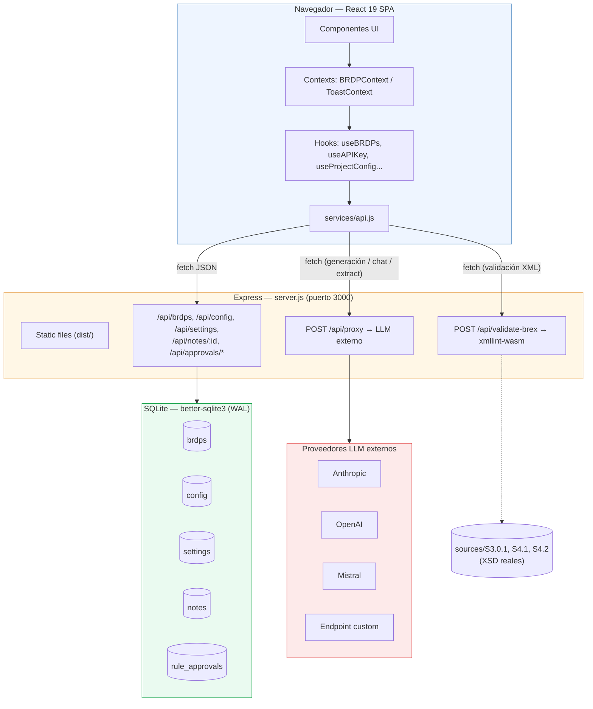
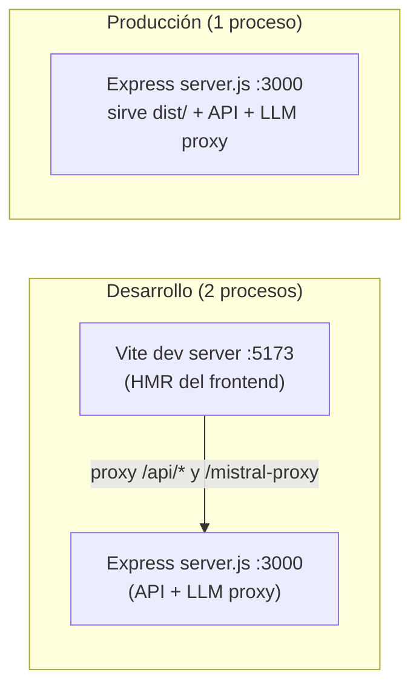
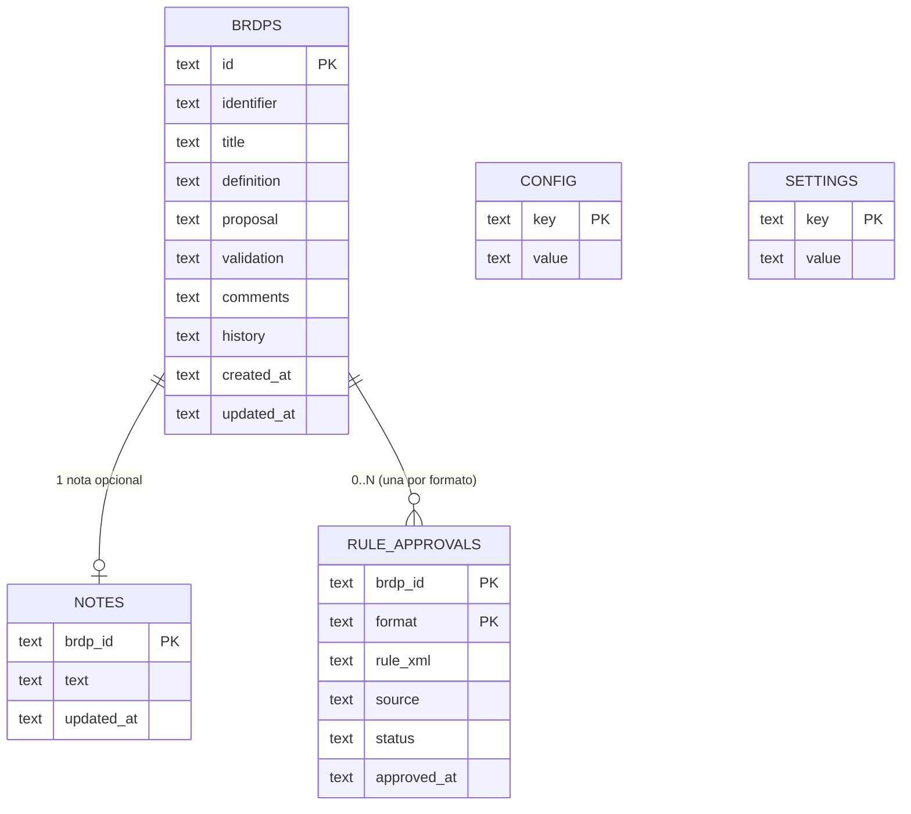
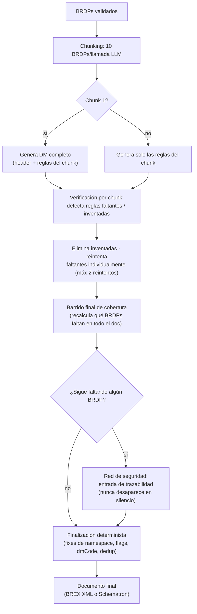

# BRDP Manager — Arquitectura actual y estructura del proyecto

> Generado a partir del código real del repo `Juanma-GA/brdp-manager` (rama por defecto, commit más reciente al analizar). Documento de referencia para decidir si se reescribe la app desde cero.

---

## 1. Qué es la app

**BRDP Manager** es una herramienta interna para gestionar *Business Rules Decision Points* (BRDPs) de proyectos de documentación técnica **S1000D** y **DITA**. Permite:

- CRUD de BRDPs con persistencia en SQLite.
- Generar **BREX Data Modules** (S1000D 4.2 / 4.1 / 3.0.1) y **Schematron 1.0** (S1000D y DITA) a partir de los BRDPs validados, usando un LLM.
- **Extraer BRDPs automáticamente** desde un documento (`.docx`/`.pdf`) o texto pegado, vía LLM.
- Un **asistente conversacional** con contexto del dataset de BRDPs.
- Validación XSD/well-formedness de lo generado.
- Import/export Excel, notas por BRDP, configuración de proyecto S1000D y de proveedor LLM.

Es una **app monolítica de un solo usuario, pensada para uso local/interno** (no hay autenticación, no hay multi-tenant).

---

## 2. Arquitectura general



### 2.1 Dos modos de ejecución



- **Desarrollo:** `npm run dev` (Vite, puerto 5173) **+** `npm start` (Express, puerto 3000) en dos terminales. Vite solo reenvía `/api/*` y `/mistral-proxy`; si el backend no está arrancado, los guardados fallan con un toast visible (no silenciosamente).
- **Producción:** `npm run build && npm start`. Express sirve el build de Vite (`dist/`) y la API en un único puerto.
- El frontend detecta el entorno con `import.meta.env.PROD` / `DEV` para decidir a qué ruta llamar.

### 2.2 Persistencia y "fuente de verdad"

Patrón repetido en los hooks de datos (`useBRDPs`, `useAPIKey`, `useProjectConfig`, `useLocalNotes`):

1. Estado inicial leído de `localStorage` (carga instantánea, sin esperar red).
2. `useEffect` que hace `fetch` a la API al montar — **esa es la fuente de verdad real**.
3. Los guardados van a la API **y** a `localStorage` en paralelo (el segundo es solo caché/fallback de arranque).
4. La interfaz pública de cada hook no cambia aunque cambie el backend.

> `localStorage` nunca se usa como único almacén de datos de negocio: es un caché de arranque delante de SQLite. Esto es relevante para el análisis de requisitos del punto 3 (ver `HR1`).

### 2.3 Modelo de datos (SQLite)



- `config`: metadatos del proyecto S1000D (Model Ident Code, Issue, idioma, clasificación de seguridad, etc.) como pares clave-valor.
- `settings`: configuración del proveedor LLM (API key, modelo, endpoint custom) — **la API key se guarda en texto plano** en esta tabla (ver punto 3).
- `rule_approvals`: snapshot congelado de la regla generada para un `(brdp, formato)` — permite que la columna "Rule Approval" de la tabla no dependa de regenerar todo.

### 2.4 Pipeline de generación BREX / Schematron (arquitectura defensiva)

Los 5 generadores (`generateBREX.js` 4.2, `generateBREX41.js`, `generateBREX301.js`, `generateBREXSch.js` S1000D, `generateSchematronDITA.js`) comparten el mismo patrón, pensado para que un LLM no pierda ni invente reglas en datasets grandes (400+ BRDPs):



Particularidad: **Schematron S1000D no se genera directamente por LLM** — se genera un BREX 3.0.1 (con toda esta robustez) y se convierte de forma **100% determinista** con `brexToSchematron.js`. **Schematron DITA sí es un pipeline LLM directo** (DITA no tiene equivalente a BREX), por lo que su única red de seguridad real es la validación post-generación.

### 2.5 AI Extract (extracción de BRDPs desde documentos)

```mermaid
flowchart LR
    Doc[".docx / .pdf / texto pegado"] --> Extract["mammoth (docx) / pdfjs-dist (pdf)"]
    Extract --> Chunks["Chunks de 6000 car., overlap 600"]
    Chunks --> Prompt["buildExtractionPrompt()"]
    Prompt --> LLM["LLM (temp 0.2)"]
    LLM --> Parse["Parseo JSON"]
    Parse --> Dedup["Dedup por similitud"]
    Dedup --> IDs["IDs secuenciales BRDP-EXT-NNNNN"]
    IDs --> Preview["Preview + import (añadir o reemplazar)"]
```



---

## 3. Estructura de carpetas y ficheros

```
brdp-manager/
├── .env.example                      # Variables de entorno de ejemplo (NODE_ENV, PORT)
├── .gitignore
├── CLAUDE.md                         # Contexto de arquitectura para Claude Code (muy completo)
├── README.md                         # Documentación de usuario/instalación
├── package.json / package-lock.json
├── index.html                        # Punto de entrada Vite
├── vite.config.ts                    # Config Vite (proxy /api y /mistral-proxy en dev)
├── tsconfig.json / tsconfig.app.json / tsconfig.node.json   # Config TS (ver nota más abajo)
├── eslint.config.js
├── postcss.config.js / tailwind.config.js
├── server.js                         # Servidor Express (producción): static + API REST + proxy LLM
├── Dockerfile                        # Build multi-stage → nginx (solo estático, SIN backend)
├── docker-compose.yml                # Levanta el Dockerfile anterior
├── nginx.conf
│
├── public/                           # Assets estáticos + "schemas resumen" para el LLM (few-shot)
│   ├── brex-schema-summary-3-0-1.json
│   ├── brex-schema-summary-4-1.json
│   ├── brex-schema-summary-4-2.json
│   ├── brex-schema-summary-sch.json  # (ya no se usa, se conserva por si acaso)
│   ├── schematron-dita-schema-summary.json
│   ├── favicon.svg / icons.svg
│
├── scripts/                          # Scripts de test manuales (fuera de la app)
│   ├── test-schematron-dita.mjs
│   └── test-schematron-dita-lets.mjs
│
├── sources/                          # Material de referencia S1000D/DITA (XSD reales, plantillas)
│   ├── S3.0.1/ , S4.1/ , S4.2/       # XSD BREX oficiales por issue → validación real (server.js)
│   ├── D1.3/                         # XSD DITA 1.3 completo (base, bookmap, technicalContent...)
│   ├── D1.3fewshot/                  # Ejemplos held-out y ficheros de prueba para el generador DITA
│   ├── Issue 4.2 S1000D Business Rules Decision Points v4.8.xlsx
│   └── brdp-template*.xlsx           # Plantillas de import Excel
│
└── src/
    ├── main.jsx                      # Entry point React (ReactDOM.createRoot)
    ├── App.jsx                       # Layout raíz, routing entre páginas, montaje de modales globales
    ├── App.css / index.css
    │
    ├── api/                          # Lógica de negocio: generadores LLM + extracción (SIN UI)
    │   ├── llmAPI.js                     # Cliente LLM agnóstico (Anthropic/OpenAI/Mistral/Custom)
    │   ├── generateBREX.js               # Generador BREX S1000D 4.2 + helpers compartidos (extractXML, checkWellFormed)
    │   ├── generateBREX41.js             # Generador BREX S1000D 4.1
    │   ├── generateBREX301.js            # Generador BREX S1000D 3.0.1
    │   ├── generateBREXSch.js            # Schematron S1000D (reutiliza BREX 3.0.1 + conversor determinista)
    │   ├── brexToSchematron.js           # Conversor BREX→Schematron 100% determinista (sin LLM)
    │   ├── generateSchematronDITA.js     # Schematron DITA (pipeline LLM directo)
    │   ├── generateSuggestedRule.js      # Normaliza los 5 generadores para "sugerir 1 regla" desde el chat
    │   ├── validateBREX.js               # Cliente de /api/validate-brex (validación XSD real)
    │   ├── buildBREXdocReport.js         # Informe de cierre de revisión (HTML/Markdown), sin llamadas API
    │   ├── extractBRDPs.js               # AI Extract: DOCX/PDF/texto → BRDPs
    │   └── approvals.js                  # Cliente REST de /api/approvals/*
    │
    ├── components/                   # Componentes React de presentación
    │   ├── Header.jsx / .module.css          # Cabecera + botones de acción global
    │   ├── Sidebar.jsx / .module.css         # Navegación lateral colapsable
    │   ├── BRDPTable.jsx / .module.css       # Tabla principal de BRDPs (paginada, filtrable)
    │   ├── DetailPanel.jsx / .module.css     # Panel de detalle/edición de un BRDP
    │   ├── FilterPills.jsx / .module.css     # Filtro por estado de validación
    │   ├── SearchBar.jsx / .module.css       # Búsqueda en tiempo real
    │   ├── RuleApprovalCell.jsx              # Celda de la tabla: estado de aprobación de regla por formato
    │   ├── GenerateModal.jsx / .module.css   # Modal: elegir formato BREX/Schematron y generar
    │   ├── AIExtractModal/AIExtractModal.jsx     # Modal AI Extract (fichero o texto)
    │   ├── BREXdocModal/BREXdocModal.jsx         # Modal del informe BREXdoc (HTML/Markdown)
    │   ├── ChatPanel.jsx / .module.css       # Panel lateral del asistente AI (streaming)
    │   ├── TypingDots.jsx                    # Indicador "escribiendo..." del chat
    │   ├── ToastContainer.jsx / .module.css  # Notificaciones toast
    │   ├── ProjectConfigSection.jsx          # Formulario de configuración S1000D del proyecto
    │   ├── AIConfigSection.jsx               # Formulario de configuración del proveedor LLM
    │   ├── DataManagementSection.jsx         # Import/export Excel
    │   ├── ResetDataSection.jsx              # Reset a datos de demo
    │   └── AboutSection.jsx                  # Info/versión de la app
    │
    ├── pages/
    │   ├── BRDPPage.jsx / .module.css        # Página principal (tabla + filtros + detalle)
    │   └── SettingsPage.jsx / .module.css    # Página de ajustes (compone las *Section anteriores)
    │
    ├── context/
    │   ├── BRDPContext.jsx            # Estado global de BRDPs: carga desde API, CRUD, selección
    │   └── ToastContext.jsx           # Contexto de notificaciones (accesible fuera de componentes)
    │
    ├── hooks/
    │   ├── useBRDPs.js                # Hook legado standalone (localStorage) — ver nota
    │   ├── useAPIKey.js               # Config del proveedor LLM (API + fallback localStorage)
    │   ├── useProjectConfig.js        # Config del proyecto S1000D (API + fallback localStorage)
    │   ├── useLocalNotes.js           # Notas por BRDP (API + fallback localStorage)
    │   ├── useTableLogic.js           # Filtro/orden/paginación de la tabla (25 filas/página)
    │   └── useChat.js                 # Lógica del asistente: contexto del dataset, guardas de validación
    │
    ├── services/
    │   └── api.js                     # Única capa fetch hacia el backend Express (BRDPs, config, settings, notes)
    │
    ├── db/
    │   ├── database.js                # Conexión better-sqlite3 (WAL mode), crea data/brdp.db
    │   └── schema.sql                 # DDL: brdps, config, settings, notes, rule_approvals
    │
    ├── data/
    │   ├── brdpSchema.js              # Definición de campos/tipos de un BRDP (para formularios/validación)
    │   └── mockBRDPs.js               # Dataset de demo (usado por "Reset a datos de demo")
    │
    ├── utils/
    │   └── excelUtils.js              # Import/export Excel (xlsx), mapeo de columnas
    │
    └── assets/
        ├── hero.png, react.svg, vite.svg
```

> **Nota — `src/hooks/useBRDPs.js` vs `src/context/BRDPContext.jsx`:** existen dos implementaciones de "estado de BRDPs": un hook standalone más antiguo basado en `localStorage` (`useBRDPs.js`) y el `BRDPContext` (con API + fallback) que es el que realmente usa `App.jsx`. Es probable que `useBRDPs.js` sea código heredado no referenciado activamente — conviene confirmarlo con un grep de imports antes de reescribir, porque es justo el tipo de "código muerto" que el framework AACF prohíbe (`HR13`, ver documento 2).

---

## 4. Ficheros clave — qué hace cada uno (detalle)

### 4.1 Raíz del proyecto

| Fichero | Responsabilidad |
|---|---|
| `server.js` (438 líneas) | Único backend. Sirve `dist/` en producción, expone `/api/proxy` (reenvío autenticado al LLM externo), `/api/validate-brex` (validación XSD real vía `xmllint-wasm` contra los XSD de `sources/`), y el CRUD REST de `brdps`, `config`, `settings`, `notes`, `approvals`. |
| `vite.config.ts` | Config de Vite; en dev, proxea `/api/*` y `/mistral-proxy` hacia `localhost:3000`. |
| `Dockerfile` / `docker-compose.yml` / `nginx.conf` | Build multi-stage que compila el frontend y lo sirve con nginx. **No incluye el backend Express ni SQLite** — solo válido para demo estática (lo confirma el propio README). |
| `.env.example` | Solo `NODE_ENV` y `PORT`. No hay más variables de entorno gestionadas centralizadamente (ver documento 2, `HR0`/`HR8`). |

### 4.2 `src/api/` — generadores y lógica LLM (el "core" de negocio)

| Fichero | Líneas | Responsabilidad |
|---|---|---|
| `llmAPI.js` | 330 | Cliente LLM agnóstico: construye headers/payload según proveedor (Anthropic/OpenAI/Mistral/Custom), maneja streaming. |
| `generateBREX.js` | 618 | Generador BREX S1000D **4.2**. Contiene también `extractXML()` y `checkWellFormed()`, importados por todos los demás generadores (nunca duplicados). |
| `generateBREX41.js` | 561 | Generador BREX S1000D **4.1** (mismo core que 4.2, pero sin `brDecisionRef`/`brSeverityLevel`, que no existen en ese XSD). |
| `generateBREX301.js` | 479 | Generador BREX S1000D **3.0.1** (`<objrule>`, `objappl` 0/1, sin `nonContextRules` como elemento — se representan como comentario XML). |
| `generateBREXSch.js` | 31 | Schematron S1000D: reutiliza `generateBREX301` y convierte con `brexToSchematron()`. |
| `brexToSchematron.js` | 299 | Motor **determinista** BREX→Schematron (port del XSL de referencia de Docuneering, Apache-2.0), reutilizable e independiente. |
| `generateSchematronDITA.js` | 797 (el fichero más grande del repo) | Schematron DITA, pipeline LLM directo sin BREX intermedio; incluye su propio validador de bien-formado (`checkWellFormedSchematron`) y un lint de vocabulario no bloqueante. |
| `generateSuggestedRule.js` | 45 | Normaliza los 5 generadores anteriores en una única función para el modo "sugerir regla" del chat. |
| `validateBREX.js` | 20 | Cliente de `/api/validate-brex` (validación XSD real; solo disponible con el backend Express arrancado). |
| `buildBREXdocReport.js` | 260 | Genera el informe de cierre de revisión (HTML/Markdown) 100% en cliente, sin llamar a ningún API. |
| `extractBRDPs.js` | 345 | AI Extract: extrae texto de DOCX (`mammoth`)/PDF (`pdfjs-dist`), trocea, prompt, parsea JSON, deduplica. |
| `approvals.js` | 53 | Cliente REST de `rule_approvals` (mismo patrón que `services/api.js` pero solo para notas de aprobación). |

### 4.3 `src/components/` — UI

| Fichero | Responsabilidad |
|---|---|
| `Header.jsx` | Cabecera con título y botones de acción (Generate, AI Extract, BRDP Assistant, BREXdoc). |
| `Sidebar.jsx` | Navegación entre página BRDP y Settings, colapsable. |
| `BRDPTable.jsx` (297 líneas + 506 de CSS) | Tabla principal: columnas, celdas de aprobación por formato, selección de fila. |
| `DetailPanel.jsx` (448 líneas + 490 CSS) | Panel de detalle/edición de un BRDP (título, definición, propuesta, validación, notas). |
| `RuleApprovalCell.jsx` | Celda que consulta de forma independiente el estado de aprobación de un BRDP para un formato dado. |
| `GenerateModal.jsx` (299 líneas + 405 CSS) | Selector de formato de salida (BREX 4.2/4.1/3.0.1, Schematron S1000D/DITA) y disparo del generador correspondiente. |
| `AIExtractModal/AIExtractModal.jsx` (385 líneas) | Modal de extracción de BRDPs desde fichero o texto pegado, con preview y deduplicación. |
| `BREXdocModal/BREXdocModal.jsx` | Modal de descarga del informe de cierre de revisión. |
| `ChatPanel.jsx` (472 líneas + 591 CSS) | Panel del asistente conversacional, con streaming y guardas de validación. |
| `FilterPills.jsx`, `SearchBar.jsx` | Filtro por estado y búsqueda en tiempo real. |
| `ProjectConfigSection.jsx`, `AIConfigSection.jsx`, `DataManagementSection.jsx`, `ResetDataSection.jsx`, `AboutSection.jsx` | Secciones de la página de Ajustes. |
| `ToastContainer.jsx`, `TypingDots.jsx` | Utilidades de UI transversales. |

### 4.4 `src/context/`, `src/hooks/`, `src/services/`, `src/db/`, `src/data/`, `src/utils/`

| Fichero | Responsabilidad |
|---|---|
| `context/BRDPContext.jsx` (261 líneas) | Estado global real de BRDPs: carga inicial desde `localStorage`, sincroniza con la API, expone CRUD + selección. |
| `context/ToastContext.jsx` | Notificaciones como contexto (no solo hook) para que hooks fuera de render (p.ej. `useProjectConfig`) también puedan lanzar toasts de error. |
| `hooks/useAPIKey.js` (132 líneas) | Config del proveedor LLM: lee/escribe `/api/settings`, con fallback a `localStorage`. |
| `hooks/useProjectConfig.js` | Config de proyecto S1000D: lee/escribe `/api/config`, con fallback a `localStorage`. |
| `hooks/useLocalNotes.js` | Notas por BRDP: API + fallback `localStorage`. |
| `hooks/useTableLogic.js` | Filtro + orden + paginación (25 filas/página) de la tabla, memoizado. |
| `hooks/useChat.js` (305 líneas) | Construye el contexto del dataset para el LLM, intercepta mensajes con triggers de cambio de estado sin llamar al LLM. |
| `hooks/useBRDPs.js` | Hook legado standalone basado solo en `localStorage` (ver nota de la sección 3). |
| `services/api.js` (109 líneas) | Única capa `fetch` hacia el backend Express — sustituye el acceso directo a `localStorage`. |
| `db/database.js` | Conexión `better-sqlite3` en modo WAL; crea `data/brdp.db` si no existe. |
| `db/schema.sql` | DDL de las 5 tablas. |
| `data/brdpSchema.js` | Definición de campos de un BRDP (tipo `string`/`enum`, valores válidos) — usado para formularios. |
| `data/mockBRDPs.js` | Dataset de demostración. |
| `utils/excelUtils.js` (184 líneas) | Import/export Excel con `xlsx`. |

### 4.5 `public/*.json` — "few-shot" para el LLM

Cada generador carga su propio JSON de esquema + ejemplos few-shot desde `public/` (se sirven como estáticos): `brex-schema-summary-4-2.json`, `-4-1.json`, `-3-0-1.json` y `schematron-dita-schema-summary.json`. El JSON se serializa **sin** el array de ejemplos (para no duplicar tokens); los ejemplos van en un bloque de prompt separado.

---

## 5. Dependencias clave

| Paquete | Uso |
|---|---|
| `react` / `react-dom` (v19) | UI |
| `express` | Servidor de producción, API REST, proxy LLM |
| `better-sqlite3` | Persistencia SQLite local (módulo nativo — requiere binario precompilado o build tools) |
| `mammoth` | Extracción de texto de `.docx` (AI Extract) |
| `pdfjs-dist` | Extracción de texto de `.pdf` (AI Extract) |
| `xlsx` | Import/export Excel |
| `xmllint-wasm` | Validación XSD real de BREX generado |
| `win-ca` | Certificados corporativos en Windows (proxy SSL-inspecting) |
| `react-markdown` | Render del chat / informes |
| `tailwindcss` v4 | Estilos (aunque el grueso de componentes usa **CSS Modules**, no utilidades Tailwind — ver documento 2) |
| `typescript` | Presente en `devDependencies` y en 3 ficheros `tsconfig*.json`, pero **no hay ningún fichero `.ts`/`.tsx` en `src/`** — todo el código fuente es `.jsx` sin tipado real. |

---

## 6. Lo que el propio proyecto documenta como "no implementado"

Recogido literalmente de `CLAUDE.md` (autoevaluación del propio equipo, no inferido):

- S1000D 5.0 y 6.0 (selector existe, botón deshabilitado con "Coming soon").
- Botón de migración BREX→Schematron sobre un BREX subido por el usuario (el motor ya existe, falta la UI).
- Migración automática de `localStorage` a SQLite en primera ejecución.
- **Autenticación** (justificado como "no necesaria para uso local single-user").
- Docker con SQLite (el `docker-compose` actual usa nginx sin backend).

Esta última lista es el punto de partida natural del documento 2 (análisis frente a AACF).
