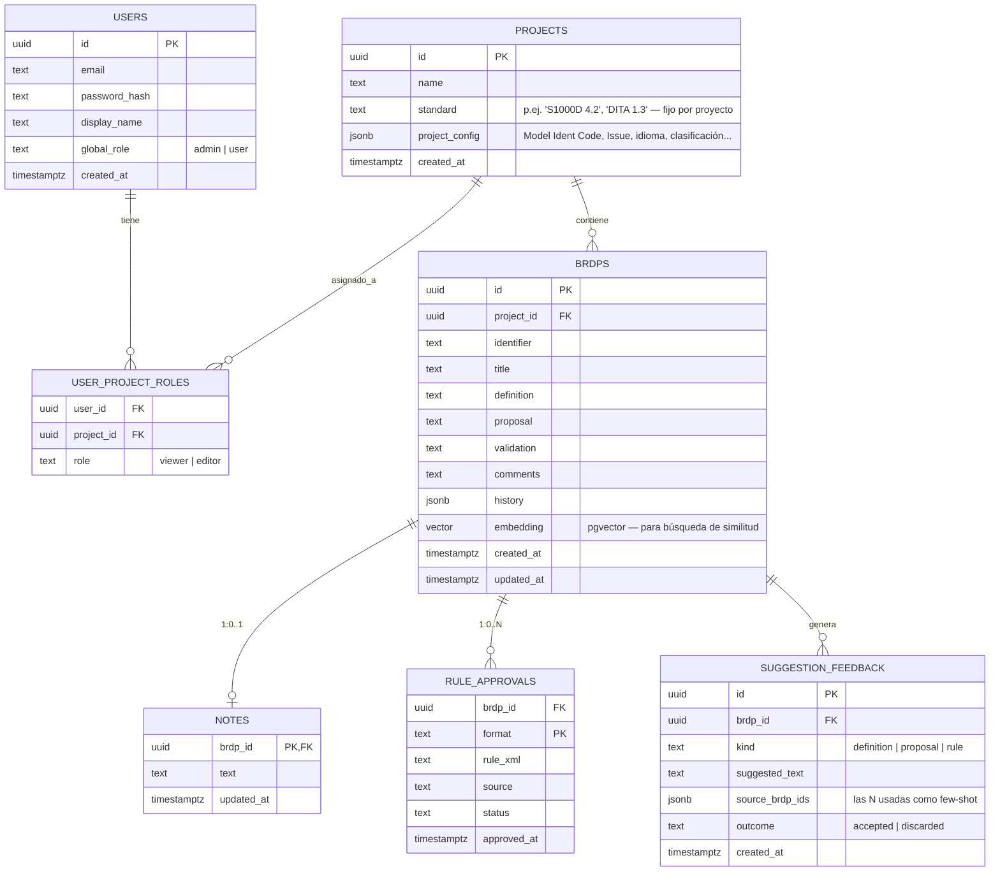

# BRDP Manager v2 — Especificación para Claude Code (nueva rama)

> Handoff para que Claude Code implemente la v2 en una rama nueva (`v2-multiproyecto` o similar) sobre `Juanma-GA/brdp-manager`. Este documento asume que Claude Code ya tiene acceso al repo real; aquí se fijan las decisiones de arquitectura, no se repite el inventario de ficheros (eso está en `01-arquitectura-y-estructura.md`).

---

## 0. Contexto y documentos previos

Esta v2 nace de tres documentos previos del mismo análisis:

1. **Arquitectura actual** (`01-arquitectura-y-estructura.md`) — qué hace cada fichero de la v1 hoy.
2. **Gap analysis AACF** (`02-analisis-aacf-requisitos-no-cumplidos.md`) — 38 de 51 requisitos del framework ATEXIS AACF no cumplidos por la v1.
3. **Mockup de la IA nueva** (`brdp-manager-v2-mockup.jsx`) — navegación, roles y flujo del BRDP Assistant ya validados visualmente por el cliente del proyecto.

Este documento traduce las decisiones tomadas sobre esos tres documentos en una especificación construible.

---

## 1. Qué cambia y qué no — principio rector

> **El motor de generación no se toca. Todo lo demás sí.**

| Capa | v1 (hoy) | v2 | ¿Se reescribe? |
|---|---|---|---|
| Generadores BREX/Schematron/AI Extract (`src/api/generateBREX*.js`, `brexToSchematron.js`, `generateSchematronDITA.js`, `extractBRDPs.js`, `buildBREXdocReport.js`) | JS, cliente | **Igual, sin tocar una línea** | ❌ No |
| Validación XSD (`validateBREX.js` + `xmllint-wasm`) | JS, cliente | Igual | ❌ No |
| Orquestación de prompts / llamadas al LLM (`llmAPI.js`, `useChat.js`, `generateSuggestedRule.js`) | JS, cliente → proxy Express | **JS, cliente → proxy FastAPI** (mismo rol, nuevo backend) | 🟡 Solo el destino del proxy |
| Persistencia | SQLite / `better-sqlite3`, síncrono | **Postgres**, async | 🔴 Reescrito |
| Servidor | Express (`server.js`, 438 líneas) | **FastAPI (Python)** | 🔴 Reescrito |
| Auth | Ninguna | **JWT propio** (bcrypt + JWT), diseñado para poder enchufar Keycloak después sin reescribir autorización | 🆕 Nuevo |
| Multi-tenancy | Ninguna (dataset global) | **`project_id` en todo** | 🆕 Nuevo |
| Navegación | `useState` sin router | **Router real** (rutas navegables) | 🔴 Reescrito |
| Búsqueda de similitud (few-shot de 10 aprobadas) | No existe | **Nueva, en FastAPI + Postgres (pgvector)** | 🆕 Nuevo |
| i18n | No existe | **Sí, obligatorio desde el primer commit** | 🆕 Nuevo |
| Tests | Ninguno | **Obligatorios** (backend + frontend) | 🆕 Nuevo |
| CORS | Abierto (`cors()`) | **Restringido a orígenes conocidos** | 🟡 Config |
| Regex sobre XML en los generadores | Sí (HR11 incumplido) | **Se deja igual — fuera de alcance de esta v2**, decisión explícita | ❌ No (por ahora) |

---

## 2. Modelo de datos (Postgres)

**Notas de diseño:**
- `role` en `USER_PROJECT_ROLES` es **por asignación**, no global — un usuario puede ser `editor` en un proyecto y `viewer` en otro. `global_role = admin` es aparte y es lo único que da acceso a `User Management` en Settings.
- `PROJECTS.standard` es **fijo al crear el proyecto** (confirmado en el mockup: "Generate BREX/Schematron" no ofrece selector, genera directamente el formato del proyecto).
- `BRDPS.embedding` requiere la extensión `pgvector` (`CREATE EXTENSION vector;`). Ver §4.
- `SUGGESTION_FEEDBACK` es la tabla que cierra el punto 2 de la sección siguiente — sin esto no hay forma de validar si el mecanismo de few-shot realmente mejora algo.
- **Migración desde v1:** el dataset actual de SQLite (sin `project_id`) se importa como un único proyecto "Legacy" al desplegar v2, no se descarta.

---

## 3. Motor de similitud para Suggest Definition / Proposal / Rule

Esto es lo que responde a "que escoja las mejores BRDPs para una respuesta más acertada" (ver discusión previa en la conversación). Requisitos concretos, no solo la idea:

1. **Embeddings**: al aprobar una BRDP (`validation = 'Validated'`), calcular y guardar su embedding (`definition + proposal` concatenados) en `BRDPS.embedding`. Recalcular si se edita una BRDP ya validada.
2. **Búsqueda**: `SELECT ... ORDER BY embedding <=> :query_embedding LIMIT 10` (pgvector, distancia coseno), filtrado por `project.standard` y `validation = 'Validated'`.
3. **Umbral mínimo de similitud — obligatorio, no opcional.** Si menos de 3 BRDPs superan el umbral, la respuesta debe indicarlo explícitamente ("precedente insuficiente") en vez de rellenar con ejemplos poco relacionados. Esto es directamente HR7 de AACF (nunca degradar en silencio).
4. **Endpoint**: `GET /api/projects/{project_id}/brdps/{brdp_id}/similar?kind=definition|proposal|rule` → devuelve hasta 10 BRDPs (id, definition/proposal/rule_xml según `kind`, score de similitud). **No llama al LLM** — solo devuelve datos. El frontend JS construye el prompt few-shot y llama al LLM vía el proxy, igual que hoy.
5. **Feedback loop**: al aceptar o descartar una sugerencia, el frontend hace `POST /api/suggestion-feedback` con el resultado. Sin analítica sofisticada de momento — basta con la tabla; revisarla manualmente al mes de uso real antes de invertir en afinar el mecanismo.
6. **Modelo de embeddings — confirmado: Mistral** (`mistral-embed` o el que esté vigente en su API), llamado a través del mismo proxy FastAPI que el resto de tráfico a Mistral — no un servicio de embeddings aparte.

   ⚠️ **Aviso de coherencia, no soy yo cambiando la decisión, solo dejándolo por escrito:** el motivo original de tener dos endpoints en `.env` (Mistral / Qwen) era la residencia de datos — Mistral cuando los datos *pueden* salir de España, Qwen (self-hosted) cuando *no pueden*. Si el proveedor de chat activo cambia a Qwen en algún despliegue, los embeddings **no pueden seguir llamando a Mistral** sin romper esa misma garantía — en ese caso haría falta un modelo de embeddings igualmente self-hosted. Para el despliegue actual (Mistral activo) esto no aplica y no bloquea nada; lo dejo anotado para que no se cuele como bug de cumplimiento el día que se active el segundo endpoint.

---

## 4. Backend — FastAPI

**Principio:** FastAPI hace CRUD, auth, autorización, proxy LLM y búsqueda de similitud. **Nunca construye prompts ni decide qué decirle al LLM** — eso sigue en `llmAPI.js` del frontend, sin excepción, para no duplicar esa lógica en dos lenguajes.

### 4.1 Stack confirmado
- FastAPI + SQLAlchemy 2.0 (async) + Postgres 16 + `pgvector`
- Alembic para migraciones
- **Auth: JWT propio, no Keycloak — decisión consciente, no ausencia de decisión.** No hay instancia corporativa de Keycloak que reutilizar, y levantar una solo para esta app no compensa ahora mismo. Esto es una **desviación documentada** de `security.mdc` (que pide Keycloak con `alwaysApply: true`), igual que la del regex en el motor de generación — no se cumple a la letra, se cumple la intención con un mecanismo más ligero. Condición explícita del cliente: **la app tiene que poder migrar a Keycloak más adelante sin reescribir la autorización.** Para que eso sea real y no una promesa vacía:
  - **Login**: `POST /api/auth/login` — email + contraseña, hash con `passlib[bcrypt]`. Emite un JWT firmado **RS256** (par de claves propio), no HS256 — así el código que *valida* el token (verificar firma contra una clave pública) es estructuralmente el mismo que se necesitaría para validar tokens de Keycloak vía JWKS; el día de mañana solo cambia de dónde sale la clave pública, no cómo se usa.
  - **Expiración corta + refresh token** (p.ej. access token 30–60 min, refresh token de vida más larga en tabla propia, revocable) — mismo patrón de dos tokens que da Keycloak, para que el frontend no tenga que rediseñarse si se migra.
  - **Autorización sin cambios**: `user_project_roles` en Postgres sigue siendo la única fuente de "qué puede hacer este usuario en este proyecto", mapeada por email/`user_id` — es exactamente igual se emita el JWT desde nuestro propio login o desde un Keycloak futuro. Esta capa no se toca el día que se decida dar el salto.
  - Backend: FastAPI valida el JWT en cada request (firma + expiración) — nunca confía en un rol que venga solo del cliente.
- CORS: `CORSMiddleware` restringido a los orígenes reales de despliegue (nunca `*`)

### 4.2 Endpoints (mapeo desde los de Express hoy)

| Endpoint v2 | Sustituye a (v1) | Cambio |
|---|---|---|
| `POST /api/auth/login`, `POST /api/auth/refresh`, `POST /api/auth/logout`, `GET /api/auth/me` | — (no existía) | Nuevo — login propio (email + contraseña, JWT RS256 access token corto + refresh token revocable). `refresh` faltaba en la tabla original; el patrón de dos tokens de §4.1 no funciona sin él. |
| `GET/POST /api/users` (solo admin) | — | Nuevo — gestión de usuarios (mockup: Settings → User Management) |
| `GET/POST /api/projects` | — | Nuevo — filtrado por proyectos asignados al usuario autenticado |
| `GET/PUT /api/projects/{id}/config` | `GET/PUT /api/config` | Añade scoping por proyecto |
| `GET /api/config/ai-provider` | — | Nuevo — proveedor LLM activo, solo lectura (§5). Faltaba en la tabla original. |
| `GET/POST /api/projects/{id}/brdps` | `GET/POST /api/brdps` | Añade scoping por proyecto |
| `PUT/DELETE /api/projects/{id}/brdps/{brdp_id}` | igual en v1 | Añade scoping |
| `GET/PUT /api/projects/{id}/brdps/{brdp_id}/notes` | `GET/PUT /api/notes/:id` | Añade scoping |
| `GET/PUT/POST /api/projects/{id}/brdps/{brdp_id}/approvals/{format}` | `/api/approvals/*` | Añade scoping |
| `GET /api/projects/{id}/brdps/{brdp_id}/similar` | — | Nuevo (§3) |
| `POST /api/suggestion-feedback` | — | Nuevo (§3) |
| `POST /api/llm-proxy` | `POST /api/proxy` | **El `targetEndpoint` deja de venir del cliente** — FastAPI resuelve el endpoint activo (Mistral o Qwen) desde su propio `.env`. Esto cierra el hallazgo S2 (SSRF) del documento 2 por construcción. |
| `POST /api/validate-brex` | igual en v1 | Sin cambios funcionales, solo de lenguaje |

Todos los endpoints de proyecto verifican `user_project_roles` en el servidor — **nunca confiar en el rol que mande el cliente** (esto es lo que el mockup deliberadamente no hacía, por no tener backend detrás).

### 4.3 Roles y permisos (matriz explícita — no estaba cerrada en la primera versión de este documento)

| Acción | `viewer` | `editor` | `global_role = admin` |
|---|---|---|---|
| Ver BRDP Records / Project Configuration / Generate | ✅ | ✅ | ✅ (en cualquier proyecto) |
| Editar/crear/borrar BRDPs, notas | ❌ | ✅ | ✅ |
| Aprobar / revocar reglas (`rule_approvals`) | ❌ | ✅ | ✅ |
| Disparar Generate BREX/Schematron | ❌ | ✅ | ✅ |
| Usar BRDP Assistant (Questions/Definition/Proposal/Rule) | ✅ solo lectura de sugerencias, no puede Aceptar | ✅ | ✅ |
| Import/Export/Reset (Data Management) | ❌ | ✅ | ✅ |
| Settings → User Management | ❌ | ❌ | ✅ (independiente del rol de proyecto) |

`viewer` es de solo lectura total, incluido el BRDP Assistant: puede pedir sugerencias para leerlas pero el botón "Aceptar" queda deshabilitado. `editor` puede todo lo del proyecto salvo administrar usuarios — eso depende exclusivamente de `global_role`, no de `user_project_roles`.

---

## 5. Frontend

- Mantiene React + Vite. **Añade routing real** (`react-router-dom`, nueva dependencia — no estaba en v1) para que las secciones sean URLs navegables: `/projects`, `/projects/:id/config`, `/projects/:id/records`, `/projects/:id/generate`, `/settings`. El mockup usaba estado local en memoria porque es un artefacto aislado; la app real necesita URLs de verdad (compartibles, con botón atrás funcional).
- **Generate BREX/Schematron pasa de modal a página propia** (`/projects/:id/generate`), sustituyendo a `GenerateModal.jsx` — confirmado por el mockup, se deja explícito aquí para que no quede solo implícito.
- `BRDPContext` pasa de cargar todo el dataset a cargar por `project_id` activo (via el router).
- Nueva sección **Settings → User Management**, visible solo si `user.global_role === 'admin'` — el backend igualmente rechaza la llamada si no lo es (el frontend oculta, el backend impide; nunca al revés).
- **AI Configuration en Settings pasa a ser de solo lectura** — muestra el proveedor activo leído de un endpoint (`GET /api/config/ai-provider`, resuelto desde `.env` del servidor), no un formulario editable.
- i18n: introducir `react-i18next` (no `next-intl` — esa librería es específica de Next.js y esta app es Vite; la referencia de `global_rules.md` a `next-intl` es solo un ejemplo, no una imposición de framework) desde el primer componente nuevo que se escriba. No traducir retroactivamente toda la v1 en esta misma tanda — al menos toda pantalla/componente nuevo de la v2 debe nacer sin strings hardcodeados. Idioma base: `en` (coherente con los strings ya existentes en v1); estructura preparada para añadir `es` después.
- Componentes: **se mantiene el enfoque actual (CSS Modules, componentes propios)**, no se adopta `shadcn/ui`/Tailwind/Zustand en esta v2 — no estaba en el alcance que confirmaste. Si en algún momento se quiere alinear del todo con `ui-kit.md` de AACF, es una fase aparte, no parte de este handoff.

### 5.1 Despliegue: quién sirve qué

- **FastAPI es solo API** — no sirve `dist/` de Vite. Coherente con `SECURITY_CONTEXT.md` del AACF, que ya describe un "NGINX gateway with rate limiting... NJS auth module validates tokens at gateway level": **nginx sirve el build estático y hace de reverse proxy hacia FastAPI para `/api/*`**, usando el `nginx.conf` que ya existe en el repo como punto de partida. Esto además da rate limiting a nivel de gateway casi gratis (cierra S5 del documento 2 sin escribir una librería de rate limiting en Python).
- El `POST /api/llm-proxy` **debe preservar streaming SSE exacto** — mismo formato de chunk que hoy (`StreamingResponse` en FastAPI espejando lo que hace `server.js` ahora). `llmAPI.js` cambia solo la URL de destino, no su lógica de parseo de stream.

---

## 6. Tests (nuevo, obligatorio)

- **Backend**: `pytest` — mínimo: un test de validación de JWT (token expirado, token firmado con otra clave, ausencia de token → todos deben rechazarse), un test de autorización por endpoint sensible (¿un `editor` del proyecto A puede tocar datos del proyecto B? debe fallar aunque el JWT sea válido), y un test del umbral de similitud del §3 (0, 2 y 15 BRDPs candidatas → verificar que el degradado explícito ocurre correctamente en el caso de pocas).
- **Frontend**: mantener lo mínimo viable con `vitest` — no hace falta cobertura total del legado JS del motor de generación (no se toca), pero sí de todo lo nuevo: routing, `ProjectContext`, y el flujo de Suggest Definition/Proposal/Rule.
- No se persigue el 80% de cobertura de `global_rules.md` en esta primera tanda — objetivo realista: que lo nuevo tenga tests, no reescribir tests para todo el legado de golpe.

---

## 7. Fuera de alcance de esta v2 (explícito, para que Claude Code no lo asuma por su cuenta)

- Keycloak — no se integra en esta v2 (sin instancia corporativa que reutilizar), pero el mecanismo de auth (JWT RS256 propio, ver §4.1) está diseñado explícitamente para poder sustituirse por Keycloak después sin tocar la capa de autorización (`user_project_roles`).
- Reescribir el motor de generación para dejar de usar regex sobre XML (HR11 del doc 2) — se deja como está.
- Adopción de `shadcn/ui`, Tailwind real, Zustand, TanStack Table — no confirmado, no se hace.
- Auditoría WCAG 2.2 AA completa, `prefers-reduced-motion` — no confirmado, no se hace (si se quiere, es un ticket aparte).
- Migración retroactiva de i18n para todo el código heredado — solo lo nuevo nace traducible.

---

## 8. Checklist de cierre — contra el documento 2 (AACF)

De los 38 gaps del documento 2, esta v2 cierra explícitamente:

- ✅ **D2** — Postgres en vez de SQLite
- 🟡 **S1** — Autenticación sí, pero **no vía Keycloak** — desviación consciente y documentada de `security.mdc` (no una ausencia de decisión), justificada en §4.1 porque no hay instancia corporativa que reutilizar. Compensada con un diseño que permite migrar a Keycloak sin reescritura si en algún momento se necesita.
- ✅ **S2** — SSRF en el proxy (el `targetEndpoint` deja de venir del cliente)
- ✅ **S3** — API key en texto plano (vive en `.env` del servidor, nunca en BD ni en el cliente)
- ✅ **S4** — CORS restringido
- ✅ **C7 / HR15** — i18n (para todo lo nuevo)
- 🟡 **C10** — Tests (parcial: lo nuevo sí, lo heredado no)
- ❌ Quedan abiertos deliberadamente: **C5/HR11** (regex XML), sección 5 del doc 2 en lo que respecta a shadcn/Zustand/TanStack, WCAG 2.2 AA completo, S5–S11 salvo los ya listados arriba.

Actualización tras revisión: nginx como gateway (§5.1) cierra además parte de **S5** (rate limiting), gratis, sin librería Python.

---

## 9. Convivencia v1 → v2 y arranque (operativa, no arquitectura)

- **No se borra nada de la v1 en esta rama.** `server.js`, `src/db/` (SQLite) y el `docker-compose.yml` actual se quedan intactos hasta que la v2 esté validada end-to-end. El corte a v2 es una decisión de despliegue posterior y explícita, no una consecuencia de esta rama.
- **Migración del dataset SQLite → proyecto "Legacy"**: el script se escribe en esta rama (`backend/scripts/migrate_v1_sqlite.py`), pero es un script operativo de una sola ejecución contra una copia de `data/brdp.db` — no forma parte de la cadena de migraciones de Alembic, no se ejecuta en CI ni en cada arranque.
- **Primer usuario admin**: script CLI (`backend/scripts/create_admin_user.py`) que lee `INITIAL_ADMIN_EMAIL` / `INITIAL_ADMIN_PASSWORD` de entorno si existen, y si no, pregunta de forma interactiva. Nada de credenciales por defecto hardcodeadas ni admin sembrado en la migración.
